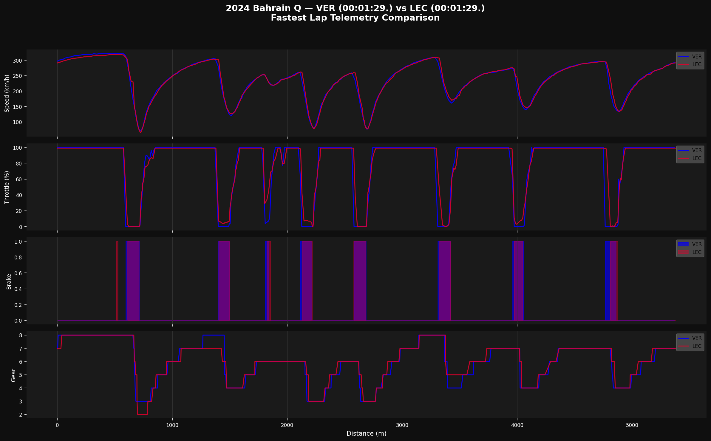
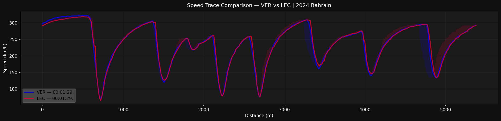

# 🏎️ F1 Telemetry Analysis Tool

**Built by:** Created by Swara Wagh — Aerospace Engineering Student | Motorsport Data & Performance Analysis  
**Stack:** Python · FastF1 · Matplotlib · Pandas · NumPy  
**Purpose:** Corner-by-corner telemetry comparison between F1 drivers using real official data.

---

## What This Does

This tool pulls **real F1 telemetry data** (speed, throttle, brake, gear, tyre life) 
from the official F1 timing feed via the FastF1 library and generates:

1. **Head-to-head telemetry panel** — 4-channel comparison (speed / throttle / brake / gear) aligned by distance
2. **Speed trace with delta shading** — visual fingerprint of where each driver is faster
3. **Tyre degradation model** — lap time vs tyre age with linear degradation rate (ms/lap) — Race sessions only

---
## Why I Built This

As an aerospace engineering student aiming for a career in motorsport engineering, I built this project to understand how race engineers interpret telemetry, compare driver performance, and make data-driven setup decisions using real Formula 1 timing data.

---

## Setup (do this once)

```bash
# 1. Clone or download this project
git clone https://github.com/YOUR_USERNAME/f1-telemetry-tool.git
cd f1-telemetry-tool

# 2. Create a virtual environment (keeps your system Python clean)
python -m venv venv
source venv/bin/activate        # Mac/Linux
# OR
venv\Scripts\activate           # Windows

# 3. Install dependencies
pip install -r requirements.txt
```

---

## Running It

```bash
cd src
python telemetry_analysis.py
```

First run takes ~30–60 seconds to download data. After that, FastF1 caches it locally
in `data_cache/` so subsequent runs are instant.

---

## Changing the Race / Drivers

Open `src/telemetry_analysis.py` and edit the **CONFIG block** at the top:

```python
YEAR        = 2024          # Any year from 2018 onwards
GRAND_PRIX  = "Bahrain"     # e.g. "Monaco", "Silverstone", "Monza"
SESSION     = "Q"           # Q=Qualifying, R=Race, FP1/FP2/FP3=Practice
DRIVER_1    = "VER"         # 3-letter codes: HAM, NOR, PIA, SAI, etc.
DRIVER_2    = "LEC"
```

---

## Output Files

All plots are saved to `outputs/` automatically:

| File | Description |
|------|-------------|
| `{YEAR}_{GP}_{SESSION}_{D1}_vs_{D2}_telemetry.png` | 4-channel telemetry panel |
| `{YEAR}_{GP}_{SESSION}_{D1}_vs_{D2}_speed.png` | Speed trace with delta shading |
| `{YEAR}_{GP}_R_{D1}_vs_{D2}_tyredeg.png` | Tyre degradation (race only) |

## Sample Output




---

## Understanding the Code — Key Concepts

### FastF1 Data Pipeline
```
fastf1.get_session()  →  creates a Session object (no data yet)
session.load()        →  downloads telemetry, timing, weather
session.laps          →  pandas DataFrame of every lap from every driver
lap.get_telemetry()   →  pandas DataFrame of sensor data (~4Hz sampling rate)
```

### Telemetry Channels Available
| Column | Unit | Description |
|--------|------|-------------|
| Speed | km/h | GPS-derived vehicle speed |
| Throttle | % (0–100) | Accelerator pedal position |
| Brake | bool | Brake pedal pressed (True/False) |
| nGear | 1–8 | Current gear |
| RPM | rev/min | Engine RPM |
| DRS | 0/1/8/10/12/14 | DRS status (10+ = open) |
| X, Y, Z | metres | Track position coordinates |
| Distance | metres | Distance from lap start (added by `.add_distance()`) |

### Why We Align by Distance (not Time)
Two drivers don't cross the start line at the same moment, so you can't 
compare `Speed at T+30s` — it means different track positions for each.
Aligning by **distance** means `Speed at 1200m` is always Turn 4 for both drivers.

### Tyre Degradation Model
We use `np.polyfit(x, y, 1)` — this fits a straight line through the 
lap time vs tyre life data points. The slope of that line = degradation rate.
Example: slope of 0.08 = lap time increases by ~80ms per lap of tyre wear.

---

## Driver Code Reference

| Code | Driver |
|------|--------|
| VER | Max Verstappen |
| NOR | Lando Norris |
| LEC | Charles Leclerc |
| HAM | Lewis Hamilton |
| PIA | Oscar Piastri |
| SAI | Carlos Sainz |
| RUS | George Russell |
| ALO | Fernando Alonso |
| STR | Lance Stroll |
| PER | Sergio Perez |

Full list: https://theoehrly.github.io/Fast-F1/driver_ids.html
